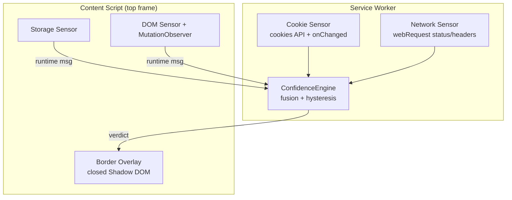
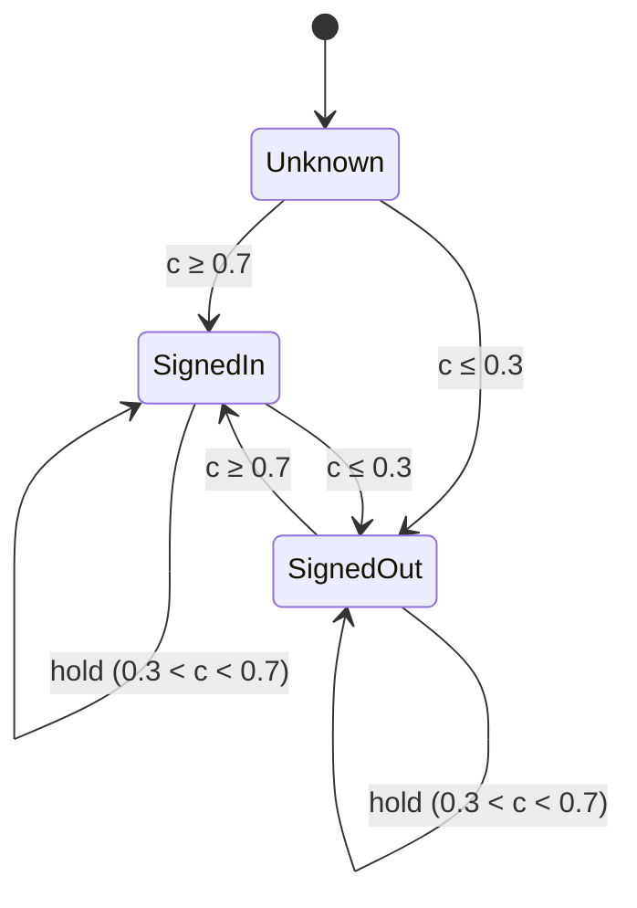
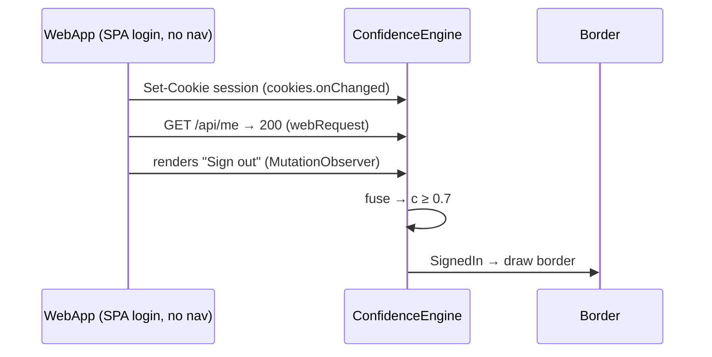

# Sign-In Detector Browser Extension — MVP Design

**Date:** 2026-07-17 · **Status:** Approved for MVP · **Deliverable:** Design doc (no code)

MVP-scoped: smallest design that satisfies every requirement. "Deferred" items are noted, not built.

---

## 1. Problem & Requirements

A browser extension that continuously decides, **per tab**, whether the user is **signed in**
to the webapp in that tab, and **draws a visible border** when they are.

- Detect signed-in vs not-signed-in.
- A webapp spans **many domains/URLs** → **cannot rely on navigation** alone.
- Works for a **variety of webapps**, **zero per-app config**.
- Signed-in → **visible border** around the viewport.

**Non-goals:** who is signed in, per-app rules, modifying the app, sending/persisting any data.

---

## 2. Approach — fuse 4 weak signals

No single signal is trusted. Observe four universal signals, fuse into a confidence score.

| Signal | Signed-in evidence | Weight |
|--------|--------------------|--------|
| **Cookie** (backbone) | HttpOnly+Secure, long-expiry, high-entropy cookie for the app | high |
| **Network** | identity endpoint (`/me`,`/session`, GraphQL `viewer`) → **200**; `Authorization: Bearer` present. **401/403 = strong negative** | high |
| **Storage** | JWT-shaped / `auth`\|`session`\|`token` keys in local/sessionStorage | medium |
| **DOM/UI** | logout/account/avatar present **and** no password login surface | low |

**Why cookies are the backbone:** a page's own JS can't read `HttpOnly` session cookies — an
**extension's `cookies` API can**. We classify cookie *shape*, never the value, and get
login/logout events via `cookies.onChanged` **without any navigation**.

---

## 3. Architecture (Chrome MV3; Firefox-compatible)

Sensors sense, engine decides, overlay draws.



Cookie + network need background scope; storage + DOM need in-page scope. The engine fuses
all four in the service worker; the content script stays a thin sensor + renderer.

**WebApp identity:** key each tab by the top frame's **registrable domain (eTLD+1)** via the
Public Suffix List, so `api.` / `cdn.` / `www.` collapse to one app. *(Deferred: OAuth-IdP
grace handling — MVP tolerates a brief re-evaluation during OAuth round-trips.)*

---

## 4. Fusion & state (with hysteresis)

Weighted mean over **observed** signals only (graceful degradation); strong negatives subtract:

```
confidence = Σ(weightᵢ · valueᵢ) / Σ(weightᵢ for observed i)
```



Middle band **holds** the previous state → no flicker. Handles "remember-me cookie but
expired session" (cookie present + endpoint 401 → stays Unknown, not a false positive).

---

## 5. Reactivity — the "no navigation" requirement

Recompute on **events**, not page loads — this is what makes SPAs and multi-domain apps work.



Triggers: `cookies.onChanged`, `webRequest` identity-endpoint status, debounced
`MutationObserver`, `storage` event.

---

## 6. Border rendering

Single overlay in the **top frame**, inside a **closed Shadow DOM** (app CSS can't touch it,
ours can't leak): `position:fixed; inset:0; pointer-events:none; z-index:2147483647`.
Signed-in → solid green inset border. Re-asserted by the MutationObserver, so it survives
SPA re-renders.

---

## 7. Privacy & permissions

- **Local-only:** each signal → a number in memory. Raw cookie/token values **never** leave
  the service worker, are never persisted, never transmitted. No outbound calls.
- **Transient state:** only `{WebAppKey → verdict}`, cleared on tab close.
- **Permissions:** `cookies`, `webRequest`, `scripting`, `storage`, host access
  (`<all_urls>` for MVP; least-privilege per-site is *deferred*). Broad host access is the
  main trust cost — stated up front.

---

## 8. Testing (MVP)

- **Unit:** ConfidenceEngine fusion + hysteresis; each signal extractor (table-driven).
- **Integration:** mock SPA — set cookie → verdict flips → border appears.
- **Manual:** 3–4 real apps (a Google property, GitHub, a plain cookie-session app), each
  with expected verdict on sign-in / sign-out.

---

## 9. Deferred (post-MVP)

Popup UI · least-privilege per-site permissions · OAuth-IdP grace rule · Unknown-state border
treatment · weight/threshold calibration beyond initial `0.7`/`0.3` estimates.
